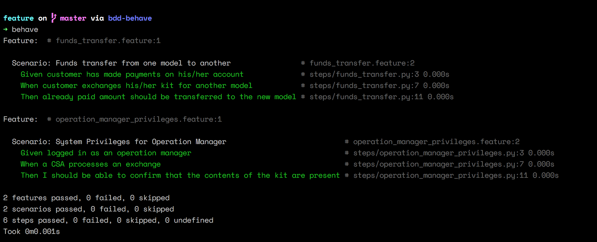

# BDD with Python

Using [behave](https://behave.readthedocs.io/en/latest/) to illustarte [BDD](https://www.wikiwand.com/en/Behavior-driven_development).

### How to:
Assuming you have [behave](https://pypi.org/project/behave/) installed:sunglasses:, in the project directory, run the below:point_down: 
```
$ behave 
```


